# Guía de uso — LorentiX

Esta guía explica paso a paso cómo instalar y usar la plataforma: desde crear tu cuenta hasta enviar un archivo malicioso al equipo de seguridad para que lo trate.

**Índice**

1. [Instalación y arranque](#1-instalación-y-arranque)
2. [Crear el administrador (terminal)](#2-crear-el-administrador-desde-la-terminal)
3. [Roles: quién puede hacer qué](#3-roles-quién-puede-hacer-qué)
4. [Crear una cuenta de usuario](#4-crear-una-cuenta-de-usuario)
5. [Iniciar sesión](#5-iniciar-sesión)
6. [Panel de control del administrador](#6-panel-de-control-del-administrador)
7. [Analizar archivos](#7-analizar-archivos-usuario-normal)
8. [Enviar un archivo infectado a IT / Ciberseguridad](#8-enviar-un-archivo-infectado-a-it--ciberseguridad)
9. [Tratar los incidentes (IT / Ciberseguridad)](#9-tratar-los-incidentes-it--ciberseguridad)
10. [Modo demo y modo VirusTotal](#10-modo-demo-y-modo-virustotal)

---

## 1. Instalación y arranque

Necesitas Python 3 instalado. Desde una terminal, dentro de la carpeta del proyecto:

```bash
python3 -m venv venv
source venv/bin/activate        # En Windows: venv\Scripts\activate
pip install -r requirements.txt
python3 app.py
```

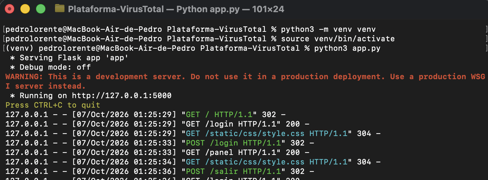

> La captura muestra el puerto 5000. En esta versión la app arranca en el **puerto 5001** (en macOS el 5000 lo ocupa AirPlay y da un error 403).

Cuando veas `Running on http://127.0.0.1:5001`, abre esa dirección en el navegador. Para parar el servidor pulsa `Ctrl + C`.

---

## 2. Crear el administrador desde la terminal

El administrador **no se puede registrar desde la web**: se crea con un script. Con el entorno virtual activado (y la app arrancada o no, da igual), abre **otra terminal** en la carpeta del proyecto y ejecuta:

```bash
python3 crear_admin.py
```

El script te pedirá:

1. **Correo** del administrador.
2. **Nombre**.
3. **Contraseña** (mínimo 8 caracteres). No se muestra mientras escribes.
4. **Repetir la contraseña**.

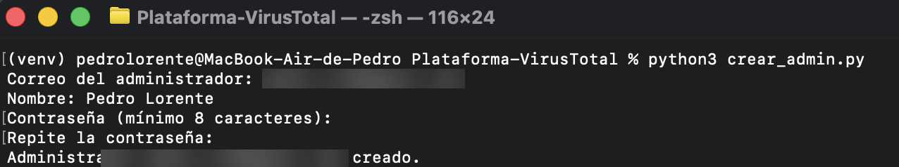

Cuando aparezca `Administrador ... creado.`, ya puedes iniciar sesión con esos datos.

---

## 3. Roles: quién puede hacer qué

| Rol | Cómo se obtiene | Qué puede hacer |
|-----|-----------------|-----------------|
| **Usuario** (RR. HH., Finanzas, Marketing, Ventas) | Registro web | Subir y analizar archivos, y enviar los infectados a IT/Ciberseguridad |
| **IT / Ciberseguridad** | Lo asigna un administrador | Lo anterior, y además recibir y gestionar incidentes |
| **Administrador** | Script `crear_admin.py` | Gestionar usuarios y consultar el historial de envíos |

> Por seguridad, **nadie puede registrarse directamente como IT o Ciberseguridad**: el administrador debe asignar ese departamento después (ver [apartado 6](#6-panel-de-control-del-administrador)).

---

## 4. Crear una cuenta de usuario

1. En la pantalla de inicio de sesión pulsa **«Crea una gratis»**.
2. Rellena **Nombre**, **Departamento**, **Correo electrónico** y **Contraseña** (mínimo 8 caracteres).
3. Pulsa **Crear cuenta**.
4. Verás el mensaje *«Cuenta creada. Ya puedes iniciar sesión.»*

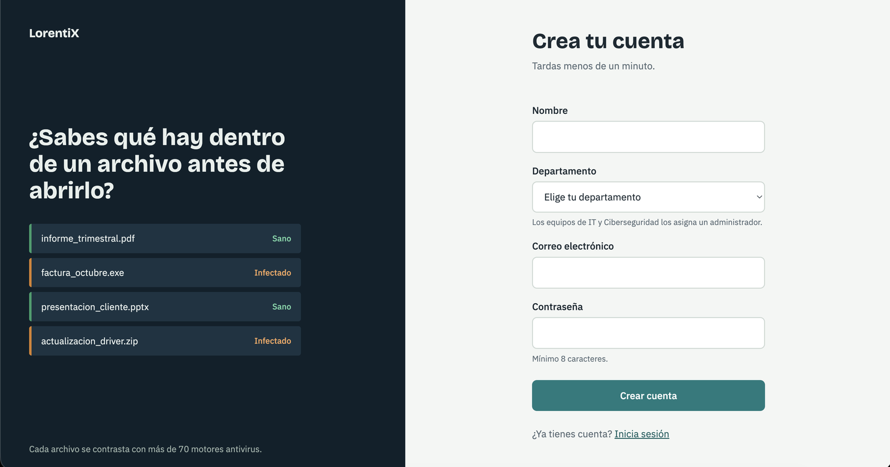

En el desplegable de **Departamento** solo aparecen los departamentos de usuario (Recursos Humanos, Finanzas, Marketing y Ventas). Como indica el aviso bajo el campo, *los equipos de IT y Ciberseguridad los asigna un administrador*.

Si el correo ya existe, o la contraseña es demasiado corta, la app te lo indicará.

---

## 5. Iniciar sesión

Escribe tu correo y contraseña y pulsa **Entrar**. Tanto los usuarios como el administrador entran por la misma pantalla:

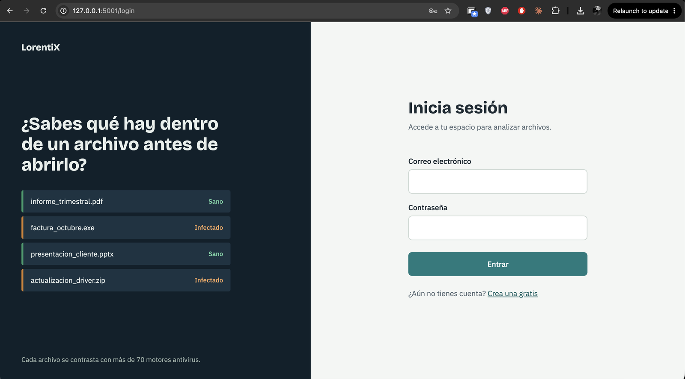

- Si eres **administrador**, accederás al **Panel de control** (`/admin`).
- Si eres **usuario** o **IT/Ciberseguridad**, accederás a tu **panel de archivos** (`/panel`).

Para salir, pulsa **Cerrar sesión** arriba a la derecha.

---

## 6. Panel de control del administrador

Al entrar como administrador verás un resumen y la gestión de usuarios:

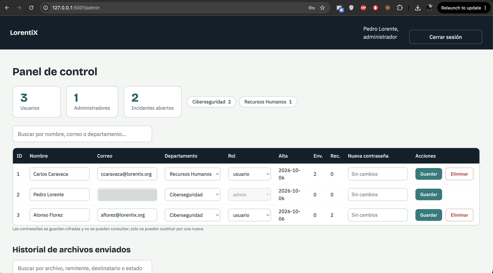

**Resumen superior**

- Número de **usuarios**, **administradores** e **incidentes abiertos**.
- Cuántos usuarios hay en cada departamento.

**Tabla de usuarios** (con buscador por nombre, correo o departamento)

- Puedes editar **nombre**, **correo**, **departamento** y **rol** de cada usuario.
- Puedes escribir una **nueva contraseña** (las contraseñas se guardan cifradas y no se pueden consultar, solo sustituir).
- Pulsa **Guardar** para aplicar los cambios y **Eliminar** para borrar la cuenta.
- Las columnas **Env.** y **Rec.** indican cuántos archivos ha enviado y recibido cada usuario.
- La cuenta del administrador está protegida: su rol no se puede cambiar ni la cuenta eliminar.

> **Cómo crear un usuario de IT o Ciberseguridad:** que la persona se registre con cualquier departamento y, después, cambia su **Departamento** a *IT* o *Ciberseguridad* y pulsa **Guardar**.

**Historial de archivos enviados**

Más abajo, el administrador ve todos los envíos al equipo de seguridad (con buscador): fecha, archivo, quién lo envía, a quién, número de detecciones, estado (*Pendiente / En revisión / Resuelto*), nota y huella SHA-256.

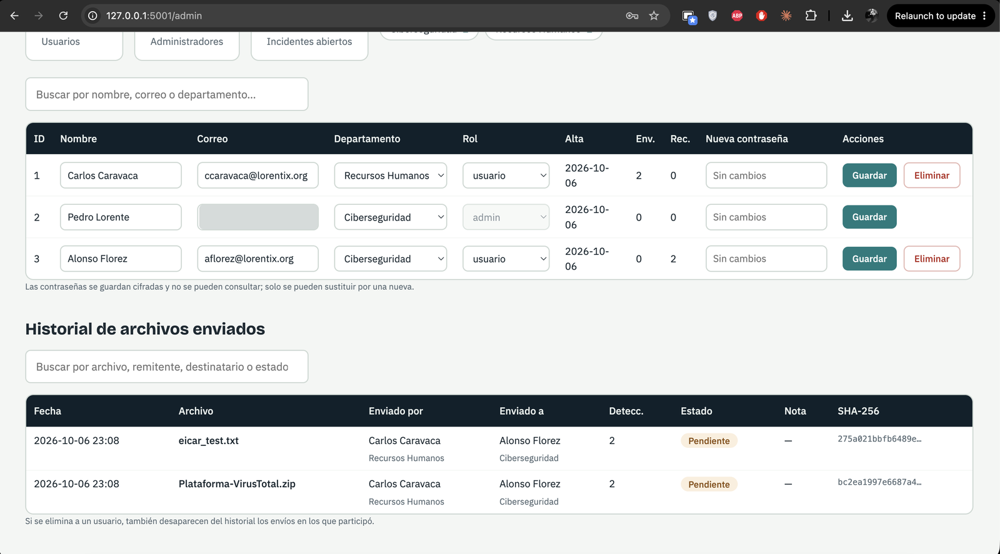

> Si se elimina a un usuario, también desaparecen del historial los envíos en los que participó.

---

## 7. Analizar archivos (usuario normal)

Este es el panel principal de cualquier usuario:

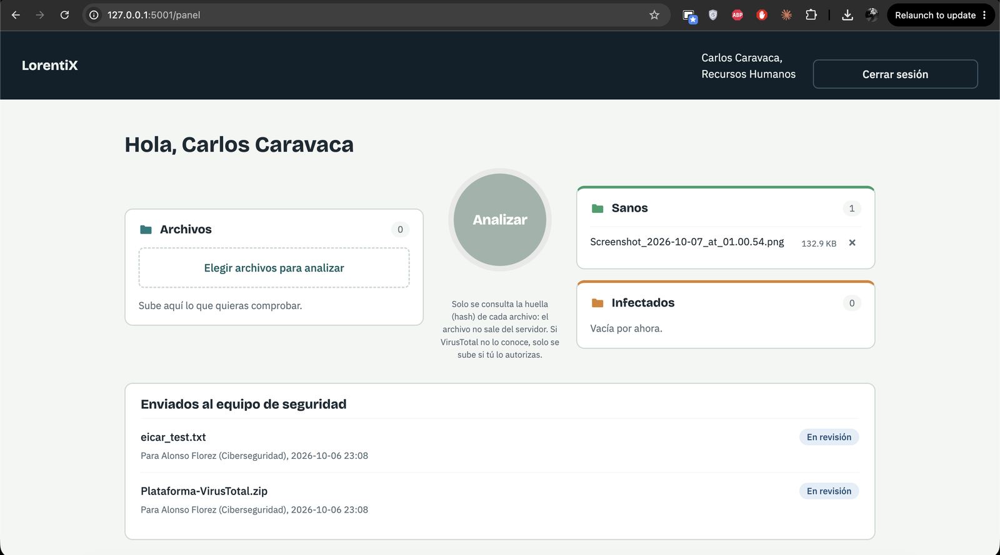

Tiene cuatro zonas:

| Zona | Función |
|------|---------|
| **Archivos** | Aquí se suben los archivos que quieres comprobar |
| **Analizar** (botón redondo) | Lanza el análisis de todo lo que haya en *Archivos* |
| **Sanos** | Archivos en los que no se detectó nada |
| **Infectados** | Archivos con detecciones de malware |

**Pasos**

1. Pulsa **«Elegir archivos para analizar»** y selecciona uno o varios archivos. Se suben automáticamente y aparecen en la carpeta *Archivos*.
2. Pulsa **Analizar**. Mientras dura el análisis, el botón muestra el progreso.
3. Al terminar, cada archivo se mueve solo a **Sanos** o **Infectados**, y aparece el informe **Último análisis** con el veredicto de cada uno y su número de detecciones.

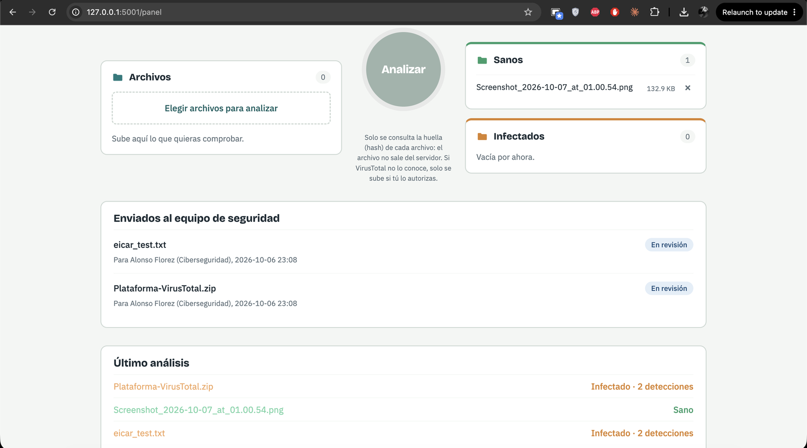

- 🟢 **Sano** — no se detectó nada.
- 🟠 **Infectado · N detecciones** — N motores (o reglas, en modo demo) lo marcan como sospechoso o malicioso.

Si te equivocas al subir algo, pulsa la **×** junto al archivo para eliminarlo.

> **Privacidad (modo VirusTotal):** solo se consulta la huella (hash) del archivo; el archivo no sale del servidor. Si VirusTotal no lo conoce, aparece la sección *«Archivos que VirusTotal no conoce»* y solo se sube **si tú lo autorizas** con el botón *«Subir los seleccionados a VirusTotal»*.

---

## 8. Enviar un archivo infectado a IT / Ciberseguridad

Los archivos que aparecen en **Infectados** no se pueden abrir ni descargar desde la plataforma: lo correcto es enviarlos al equipo de seguridad.

1. En la carpeta **Infectados**, localiza el archivo y despliega **«Enviar a IT o Ciberseguridad»**.
2. Elige el **Destinatario** (lista de personas de IT y Ciberseguridad).
3. Escribe, si quieres, una **Nota** (hasta 500 caracteres): cómo lo recibiste, qué hacía el archivo, etc. Ayuda mucho al equipo a investigar.
4. Pulsa **Enviar archivo**.

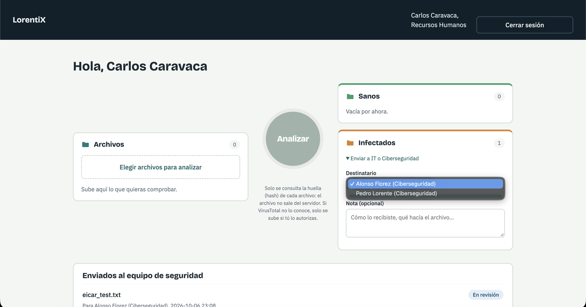

El archivo sale de tu carpeta *Infectados* y pasa a la sección **«Enviados al equipo de seguridad»**, donde puedes seguir su estado:

| Estado | Significado |
|--------|-------------|
| **Pendiente** | Enviado, nadie lo ha abierto aún |
| **En revisión** | Alguien del equipo ha tomado el caso |
| **Resuelto** | El equipo lo ha tratado y eliminado |

> Si aún no hay nadie asignado a IT o Ciberseguridad, no podrás enviar el archivo: pídele al administrador que asigne ese departamento a alguien (apartado 6).

---

## 9. Tratar los incidentes (IT / Ciberseguridad)

Los usuarios de IT y Ciberseguridad tienen, además de lo anterior, la sección **Incidentes recibidos** en su panel:

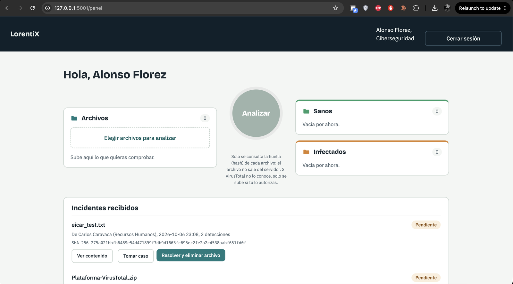

Cada incidente muestra el archivo, quién lo envía (y su departamento), la fecha, el número de detecciones, la huella **SHA-256**, la nota del remitente y su estado:

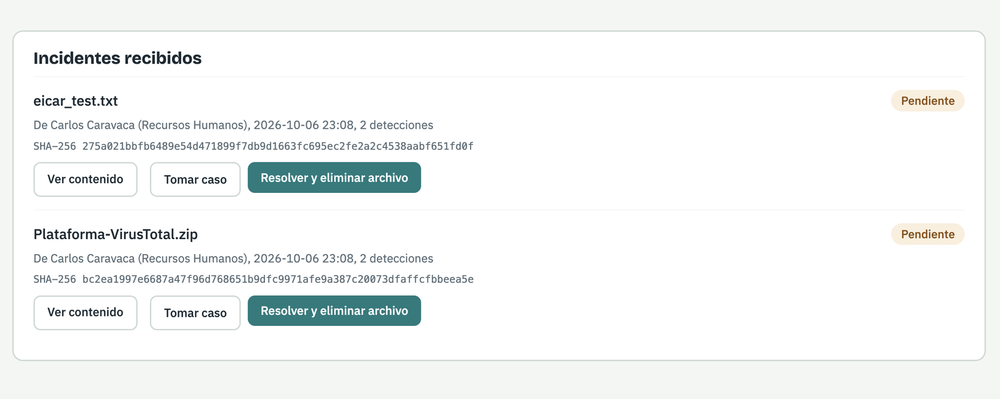

Tienes tres acciones:

### Ver contenido

Abre una **vista de solo lectura** con información técnica del archivo:

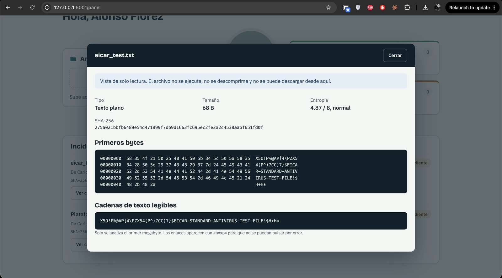

- **Tipo** de archivo, **tamaño** y **entropía** (un valor muy alto suele indicar contenido cifrado o empaquetado).
- **SHA-256**, útil para buscarlo en otras herramientas.
- **Primeros bytes** en hexadecimal y **cadenas de texto legibles**.
- Solo se analiza el primer megabyte, y los enlaces aparecen como `hxxp` para que no se puedan pulsar por error.

> **Seguro por diseño:** el archivo **no se ejecuta, no se descomprime y no se puede descargar** desde esta vista.

### Tomar caso

Cambia el estado a **En revisión**. El remitente verá que alguien se está ocupando.

### Resolver y eliminar archivo

Cuando termines, pulsa este botón: el incidente pasa a **Resuelto** y el archivo se **elimina del servidor**. El administrador seguirá viendo el registro en el historial.

---

## 10. Modo demo y modo VirusTotal

| | **Modo demo** (por defecto) | **Modo VirusTotal** |
|---|---|---|
| **Cómo se activa** | No hace falta nada | Poner `VT_API_KEY` en el archivo `.env` |
| **Motor de análisis** | Local: firmas básicas y heurísticas | API de VirusTotal (+70 motores antivirus) |
| **Internet** | No | Sí |
| **Uso recomendado** | Probar la plataforma | Uso real |

El modo demo detecta, por ejemplo: el archivo de prueba **EICAR**, dobles extensiones (`factura.pdf.exe`), ejecutables disfrazados y scripts con patrones típicos de malware. **No sustituye a un antivirus real.**

**Probar el modo demo con archivos inofensivos**

```bash
python3 generar_muestras_demo.py
```

Se crea la carpeta `muestras_demo/` con cuatro archivos de prueba (uno limpio y tres que el motor marcará como infectados). Súbelos desde tu panel y pulsa **Analizar**.

**Activar el modo VirusTotal**

1. Copia `.env.example` a `.env`.
2. Rellena `VT_API_KEY` (tu clave de [virustotal.com](https://www.virustotal.com)) y `SECRET_KEY` (una cadena larga y aleatoria).
3. Reinicia la app.
